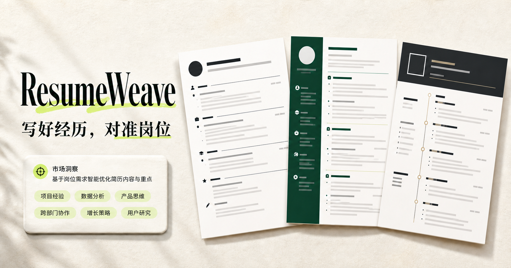

<div align="center">


# ResumeWeave

### 把零散经历，织成一份好简历。

一款面向应届生与职场人的 AI 简历生成器。输入目标岗位和真实经历，自动获得可编辑、能导出、贴合岗位需求的完整简历。

[](https://resumeweave.jjhuang.chatgpt.site/)
[](https://www.typescriptlang.org/)
[](https://react.dev/)

</div>



## 为什么做 ResumeWeave

很多人并不是没有经历，而是不知道怎样把课程项目、校园实践、实习和技能写成一份有说服力的简历。ResumeWeave 不只给出泛泛的修改建议，而是直接把用户提供的素材整理、扩写并写进简历。

## 核心能力

| 能力 | ResumeWeave 会做什么 |
| --- | --- |
| **从零生成简历** | 根据目标岗位、教育背景、项目、校园实践和工作经历，生成结构完整的简历 |
| **经历优化扩写** | 将简单描述改写成包含行动、方法和结果的专业表述，不虚构数字和事实 |
| **岗位需求匹配** | 研究公开岗位信息，提炼企业常见要求，并提示值得补充的真实能力与经历 |
| **应届生友好** | 没有正式工作经历也能用项目、课程、社团、比赛和志愿活动组织简历 |
| **技能证书说明** | 自动识别四六级等证书，并用“技能 / 证书，具体能力与使用场景”的方式补充说明 |
| **自由编辑与导出** | 生成后可直接修改内容、切换模板、复制文本并保存为 PDF |

## 使用流程

```text
填写目标岗位与经历
        ↓
AI 整理并优化真实素材
        ↓
生成完整、可编辑的简历
        ↓
切换模板 / 手动调整 / 导出 PDF
```

## 适合谁使用

- **应届毕业生**：把课程项目、校园实践和证书转化成简历亮点
- **实习求职者**：针对目标岗位快速整理可投递版本
- **职场人士**：提炼工作成果，减少流水账式描述
- **转行求职者**：识别可迁移能力，重新组织过往经历

## 本地运行

需要 [Node.js](https://nodejs.org/) 22.13 或更高版本。

```bash
git clone https://github.com/shuhuihuang0704/resumeweave.git
cd resumeweave
npm install
npm run dev
```

打开终端显示的本地地址即可使用。

### 常用命令

```bash
npm run dev      # 启动开发环境
npm run build    # 构建生产版本
npm run lint     # 检查代码规范
npm test         # 构建并运行测试
```

## 技术栈

- **前端**：React 19、TypeScript、CSS
- **构建**：vinext、Vite
- **简历导出**：html2canvas、jsPDF
- **数据层**：Drizzle ORM
- **部署**：Cloudflare Workers-compatible runtime

## 项目结构

```text
resumeweave/
├── app/                 # 页面、样式与岗位研究 API
├── db/                  # 数据库结构与连接
├── public/              # 图标和产品图片
├── tests/               # 页面生成测试
├── worker/              # Worker 入口
└── .openai/             # 托管配置
```

## 设计原则

1. **直接帮用户写**，不把复杂分析丢给用户处理。
2. **只优化真实经历**，不会编造公司、项目、成绩或量化结果。
3. **先保证内容清楚**，再考虑术语、关键词和视觉包装。
4. **生成后仍可编辑**，用户始终拥有最终决定权。

---

<div align="center">

如果 ResumeWeave 对你有帮助，欢迎点一个 ⭐

[立即体验](https://resumeweave.jjhuang.chatgpt.site/) · [查看源码](https://github.com/shuhuihuang0704/resumeweave)

</div>
